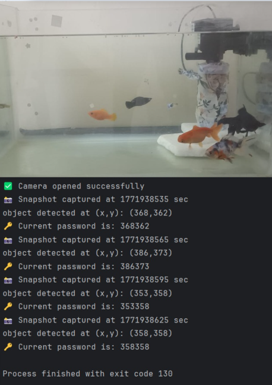

# MotionSecuritySystem
A computer vision-based security system that generates dynamic passwords using real-time fish movement tracking.

## Overview

The system captures live video from a camera, detects the fish using OpenCV image processing techniques, extracts its coordinates, and generates a dynamic password based on its position.

## Tech Stack

- Java
- OpenCV
- IntelliJ IDEA

## Concepts Used

- Object-Oriented Programming
- Interfaces
- Inheritance
- Method Overriding
- Encapsulation
- Computer Vision
- Thresholding
- Contour Detection
- Image Moments

## Workflow

Camera Feed
→ Frame Capture
→ Grayscale Conversion
→ Thresholding
→ Contour Detection
→ Coordinate Extraction
→ Password Generation

## Future Improvements

- Improved object tracking
- Better lighting adaptation
- Multi-object detection
- GUI dashboard
